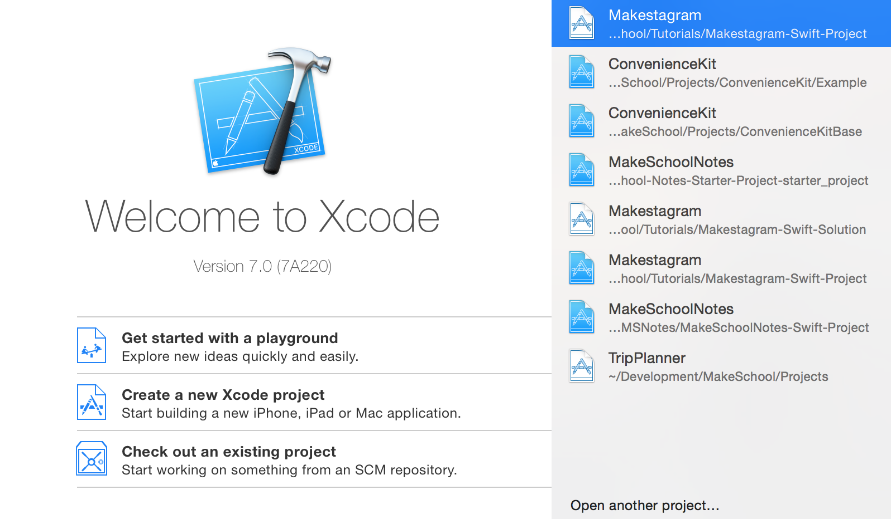

---
title: "Welcome to Xcode"
slug: welcome-xcode
---     

Xcode is Apple’s integrated development environment (IDE). Xcode includes a source editor, a graphical user interface editor, and many other features. 
It's a fantastic development tool for iOS development and one that you will be making frequent use of - you've only just scratched the surface while 
experimenting in the Swift Playground.

If you would like to learn more about Xcode in general, then Apple has you covered. [developer.apple.com/xcode](https://developer.apple.com/xcode/)

##Let's get started

Open up Xcode and you will be presented with the following options:

Notice the *Version* 6.3.1. Swift is a new language and is still maturing with every release, so you will require at least 6.3.X.
The easiest way is to install Xcode via the Mac App Store which will always keep you up to date with the latest release.

##Your first project

Select *Create a new Xcode project*

You will then be presented with the following project options:

As you can see there are a lot of options. However, let's take it easy and start off by selecting `Single View Application` and select *Next*.

##Project Options

You will now be presented with the new project options:

Feel free to give it whatever Product Name or Organization Name you like. It's your project after all! 
Please ensure you selected *Swift* as the choice for *Language*, then select *Next*.

##Source Control

Time to save your project to disk:

I would recommend enabling the *Create Git repository* option at the bottom of the dialog.  For a project this size it may not be strictly necessary. However, it's a great habit to get into
and source control has saved many a developer's life.  We will explore Source Control with Git a bit later on in this tutorial.

If you would like some further reading on the joys of Git, you should check out the [Wikipedia Git](http://en.wikipedia.org/wiki/Git_%28software%29)

You might end up with a pop-up that looks like this. You must hit allow to continue, but we recommend you choose `Always allow`.

##Run, Run, Run

It's always good to check that a project works before starting any new work. Simply hit the *Play* icon to *Build* and *Run* the application.

That was quick...

 

The first image shows the loading *View* and then loads in our default *ViewController*. As expected it's blank canvas crying out to be worked on.

Let's move on and take a look at the *Interface Builder*.
